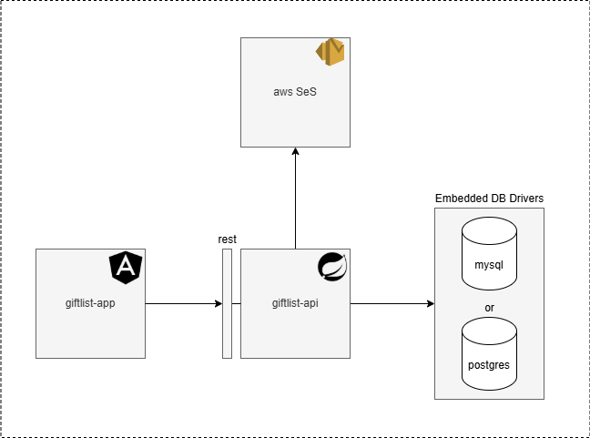

# Giftlist


**Giftlist** is a web application designed to create gift lists for festive occasions and share them with guests. The purpose of this project is to test features of Angular 18, Java 21, Spring Boot 3 and also AWS. It consists of two main parts: the frontend (built with Angular 18) and the backend (built with Java 21 and Spring Boot 3).

This repository is organized as follows:

- **giftlist-app**: The frontend of the application, developed using Angular 18.
- **giftlist-api**: The backend of the application, developed using Java 21 and Spring Boot 3.
- **scripts-db**: Used to create the tables.
- **scripts-db**: Diagrams used during the development.

The API is configured to connect to either MySQL or PostgreSQL databases.

---




---

## Prerequisites

- **Node.js** (for the frontend)
- **Java 21** (for the backend)
- **MySQL** or **PostgreSQL** (for the database)
- **Docker** (optional, for backend containerization)
- **AWS SES** (for email functionality)

---

## Frontend Setup

The frontend of the application is built using **Angular 18**. To set up and run the frontend:

1. Clone the repository:
   ```bash
   git clone https://github.com/HenriqueFigueiredo/giftlist.git
   cd giftlist
   ```

2. Navigate to the frontend directory (giftlist-app):
   ```bash
   cd giftlist-app
   ```

3. Install the dependencies:
   ```bash
   npm install
   ```

4. Build and serve the application:
   ```bash
   npm run build
   ng serve
   ```

5. The application will be available at `http://localhost:4200`.

---

## Backend Setup

The backend of the application is built using **Java 21** and **Spring Boot 3**. To configure and run the backend:

1. Navigate to the backend directory (giftlist-api):
   ```bash
   cd giftlist-api
   ```

2. Configure the following environment variables:

    - `DB_URL=jdbc:<database_connection_url>`: The connection URL for your MySQL or PostgreSQL database.
    - `DB_USER=<database_user>`: The user for connecting to the database.
    - `DB_PASSWORD=<database_password>`: The password for the database connection.
    - `DB_DRIVER=org.postgresql.Driver` (or use MySQL driver if you are using MySQL).
    - `DB_DIALECT=org.hibernate.dialect.PostgreSQLDialect` (or use MySQL dialect if you're using MySQL).
    - `KEY_AES=<your_aes_key>`: AES encryption key.
    - `KEY_HMAC=<your_hmac_key>`: HMAC key for secure communication.
    - `SESSION_EXP_SECONDS=300`: The session expiration time in seconds.
    - `AWS_REGION=us-east-1`: AWS region for SES integration.
    - `AWS_ACCESS_KEY_ID=<your_aws_access_key_id>`: AWS Access Key ID for SES integration.
    - `AWS_SECRET_ACCESS_KEY=<your_aws_secret_access_key>`: AWS Secret Access Key for SES integration.

3. Run the backend using Spring Boot:
    - You can run the backend application usign the spring boot plugin:
      ```bash
       mvn spring-boot:run
      ```

4. To run the backend using **Docker**:
    - Ensure that Docker is installed and running.
    - Build the Docker image:
      ```bash
      mvn clean package
      docker build -t giftlist-api .
      ```
    - Run the backend container:
      ```bash
      docker run -p 8080:8080 giftlist-api
      ```
    - The backend will be available at `http://localhost:8080`.

---

## API Database Configuration

The **giftlist-api** backend is configured to connect to MySQL or PostgreSQL databases. You need to provide the database connection details through the following environment variables.

- **MySQL Configuration Example:**
  ```bash
  DB_URL=jdbc:mysql://localhost:3306/giftlist
  DB_USER=root
  DB_PASSWORD=rootpassword
  DB_DRIVER=com.mysql.cj.jdbc.Driver
  DB_DIALECT=org.hibernate.dialect.MySQLDialect
  ```

- **PostgreSQL Configuration Example:**
  ```bash
  DB_URL=jdbc:postgresql://localhost:5432/giftlist
  DB_USER=postgres
  DB_PASSWORD=postgrespassword
  DB_DRIVER=org.postgresql.Driver
  DB_DIALECT=org.hibernate.dialect.PostgreSQLDialect
  ```

---

## Running Both Frontend and Backend

To run both the frontend and backend together, you can use the following steps:

1. Start the backend first (either using Docker or Spring Boot).
2. Then, run the frontend using Angular CLI (`ng serve`).
3. The frontend will communicate with the backend API running at `http://localhost:8080`.

---